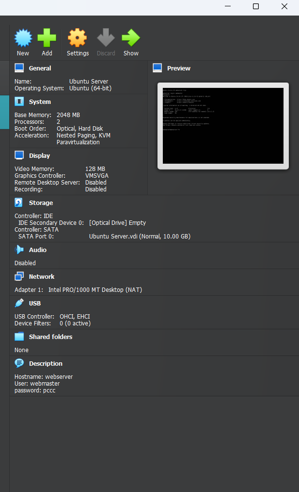
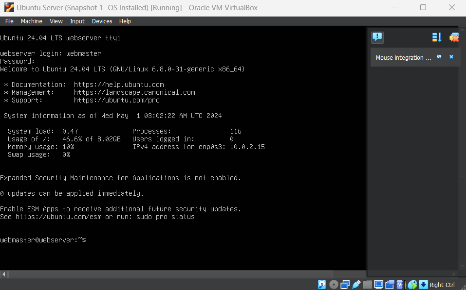
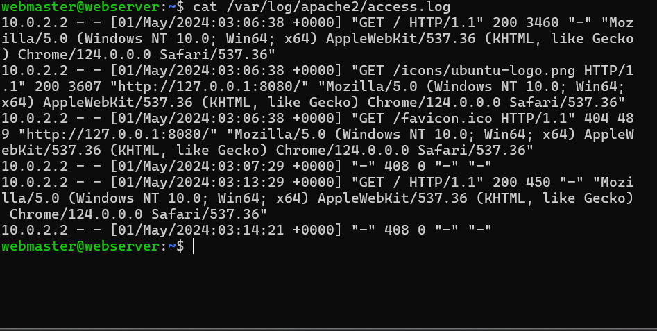

## Server Specifications

## Ubuntu Login

## Questions
* What is the IP address of your Ubuntu Server Virtual Machine?
  * `10.0.2.15`
  
* How do you enable the Ubuntu Firewall?
  * `sudo ufw enable`
  
* How do you check if the Ubuntu Firewall is running?
  * `sudo ufw status`

* How do you disable the Ubuntu Firewall?
  * `sudo ufw disable`
  
* How do you add Apache to the Firewall?
  * `sudo ufw allow 'Apache'`

* What is the command you used to install Apache?
  * `sudo apt install apache2 -y`

* What is the command you use to check if Apache is running?
  * `systemctl status apache2 --no-pager`

* What is the command you use to stop Apache?
* `systemctl stop apache2 --no-pager`

* What is the command you use to restart Apache?
  * `systemctl restart apache2`

* What is the command used to test Apache configuration?
  * `sudo apache2ctl configtest`
  
* What is the command used to check the installed version of Apache?
  * `sudo apachectl -V`
  
* What are the most common commands to troubleshoot Apache errors? Provide a brief description of each command.
  * `sudo service apache2 restart: Restarts the server`
  * `apachectl configtest: Checks the syntax and the validity of the configuration file`
  
* Which are Apache Log Files, and what are they used for? Provide examples and screenshots.
  * `The Apache log files are used to see requests from other computers, responses sent by Apache, and actions internal to the Apache server.`

